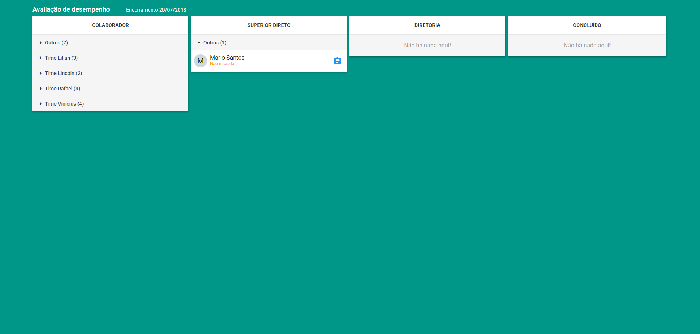
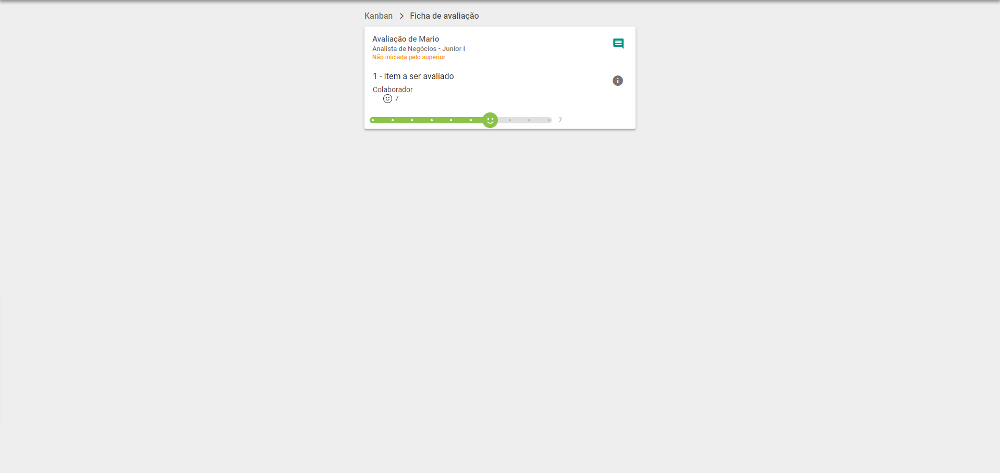
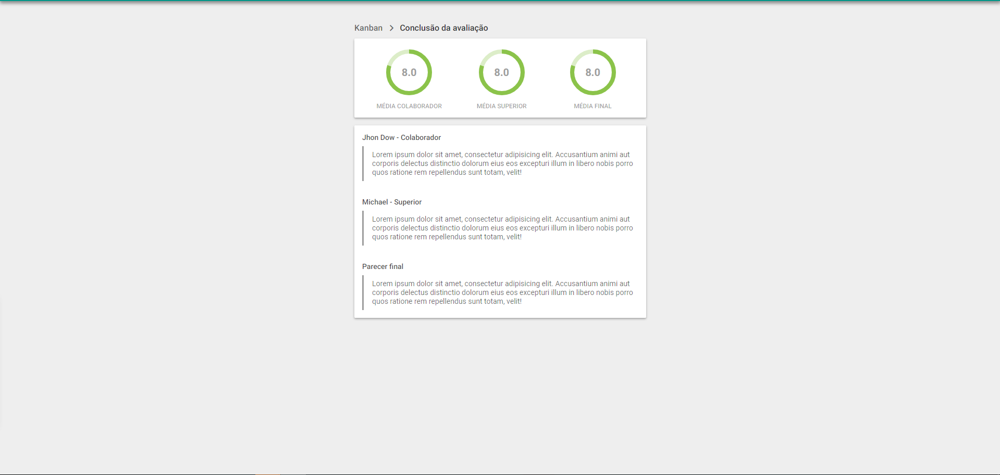

# Redesign - Avaliação de desempenho
A avaliação de desempenho foi criada a cerca de um ano, e após ver seu uso em casos reais, percebemos que dá para 
melhorar seu visual e sua navegação.

Agora precisamos ver por outras perspectivas, e por isso **estamos desafiando você a fazer a participar da construção
do novo DESIGN!**

|  | Data
------------ | -------------
Ínicio | 05/04/2018
Término | 20/04/2018

## Instruções
* O layout pode ser prototipado em qualquer plataforma, desde um photoshop até um paint
* Assim que terminar faça um **pull request** nesse repositório tendo uma pasta com seu nome e as imagens(PNG, JPG, GIF...) do seu projeto

## LET'S GO FELAS
### Step 1 - Status da avaliações
Aqui temos a tela onde é mostrado o status de todas avaliações, lembrando que ela é acessada
por 3 pessoas diferentes, o colaborador(vê apenas seu status), o superior vê a sua avalição e de todos os colaboradores
pelo qual ele é responsável, e o último a diretoria vê o status de todos.

### Step 2 - Ficha de avaliação
Aqui é onde realizamos as avaliações. Temos um range de notas(de 1 a 10) e os itens a serem avalidos, além de podermos acompanhar todo
o processo da avaliação, assim que as notas são preenchidas temos que concluí-las apontando nos aspectos positivos e negativos.

### Step 3 - Conclusão da avaliação
Aqui é onde conseguimos ver o resultado da avalição com médias e tudo que foi falado na avaliação

